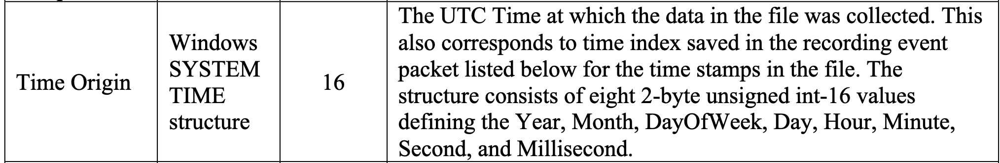
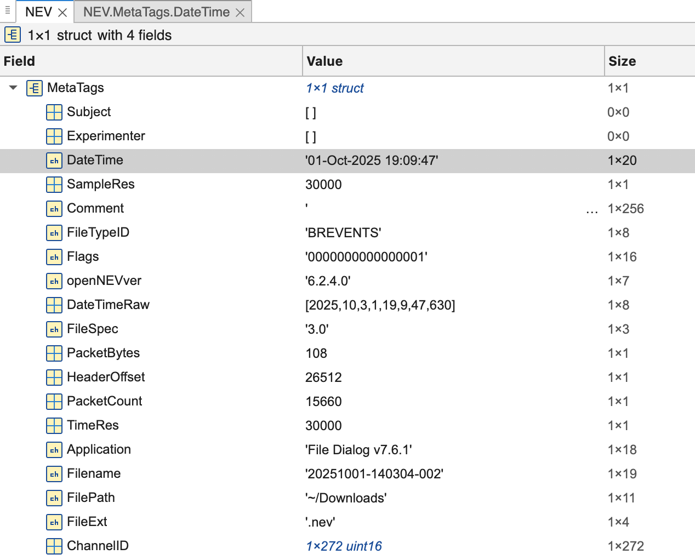
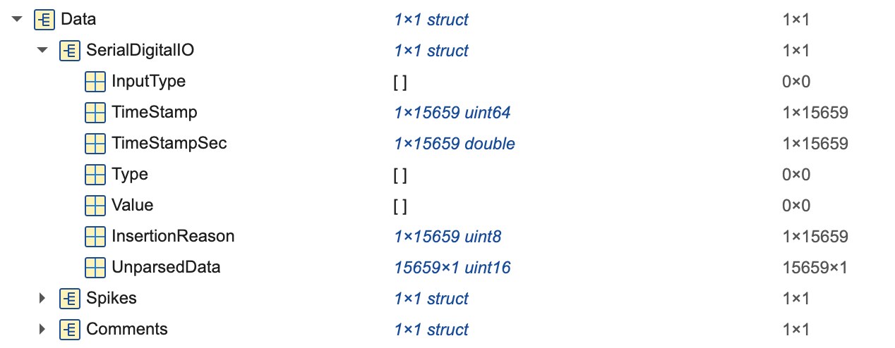
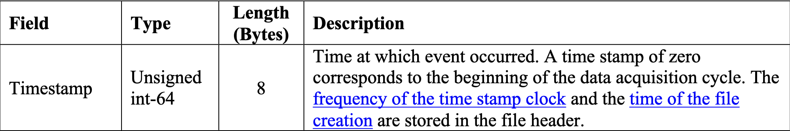
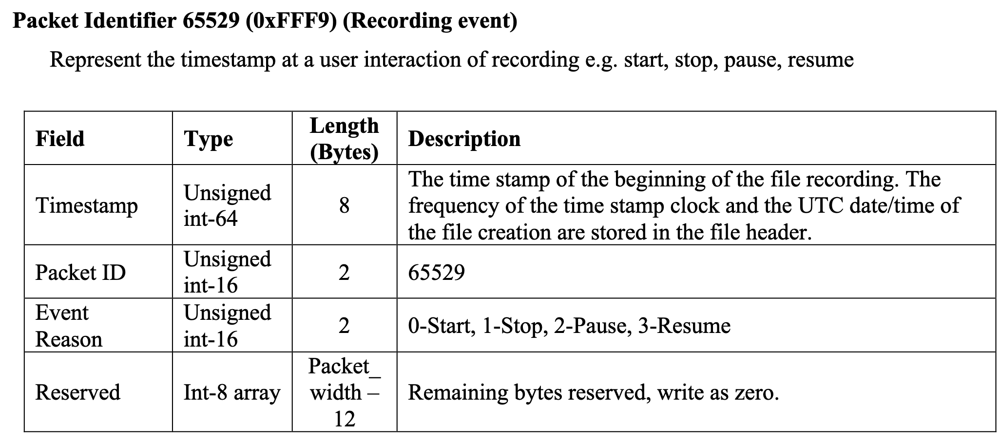
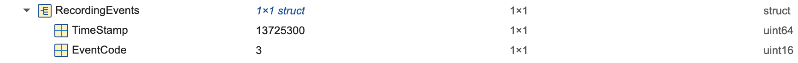

## Motivation

To synchronize video and audio without serials, the best alternative is through timestamps. Understanding how timestamps are constructured and the meanings of those is critical for the successful synchronization. This page aims to explain the timestamps in a neural recording NEV file.

---

## Time Origin

The `Time Origin` in the basic header of a NEV file, according to the [file spec](https://blackrockneurotech.com/wp-content/uploads/LB-0023-7.00_NEV_File_Format.pdf) denotes **"The UTC Time at which the data in the file was collected."**



In Matlab, reading the [sample nev](../assets/understanding_nev_timestamp/20251001-140304-002.nev), we get the value of Time Origin is `01-Oct-2025 19:09:47`



We can also load the NEV file with Python which returns `datetime.datetime(2025, 10, 1, 19, 9, 47, 630000)`. 

Note, however, this time only represents the time when the file was created, it **does not** denote the time when the recording started.

---

## Starting Time in SerialDigitalIO

Expanding the Data section of NEV, we see `SerialDigitalIO` which packs the digital data from Arduino. 



Here, it's a data structure of length `15659` with fields TimeStamp, TimeStampSec, InsertionReason, and UnparsedData. The TimeStamp here, according to [file spec](https://blackrockneurotech.com/wp-content/uploads/LB-0023-7.00_NEV_File_Format.pdf) on page 9, denotes the time at which the event occurred.



In Pandas DF format, we can see the timestamps that correspond to each digital event.


---

## Starting Time of Recording

So what's the starting time of recording?? From the file spec on page 14, the timestamp for a recording is from the Recording Events packet.



Here the recording is actually the start of a recording, not file creation. On Matlab, it's visible from the `RecordingEvents` section.



---

## UTC Time of Digital Events

So how do we get the UTC timestamp of a digital event? This is accomplished by 

```
Delta = TimeStamp in SerialDigitalIO - Starting Time of Recording
UTC Time = Time Origin + Delta / Resolution
```

In this example NEV file, we are able to reconstruct the serial dataframe with `scripts.parsers.nevfileparser`

```csv
TimeStamps,chunk_serial,UTCTimeStamp
13726437,111090007,2025-10-01 19:09:47.667900
13727438,111090008,2025-10-01 19:09:47.701267
13728439,111090009,2025-10-01 19:09:47.734633
13729441,111090010,2025-10-01 19:09:47.768033
13730442,111090011,2025-10-01 19:09:47.801400
13731444,111090012,2025-10-01 19:09:47.834800
13732445,111090013,2025-10-01 19:09:47.868167
13733446,111090014,2025-10-01 19:09:47.901533
13734447,111090015,2025-10-01 19:09:47.934900
```
