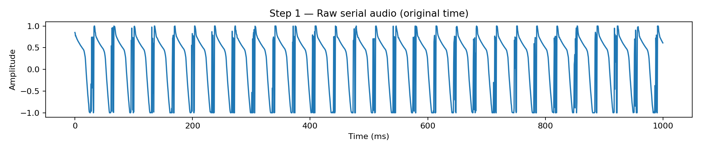
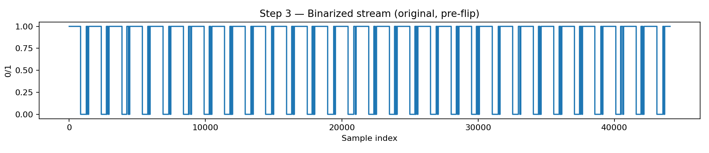
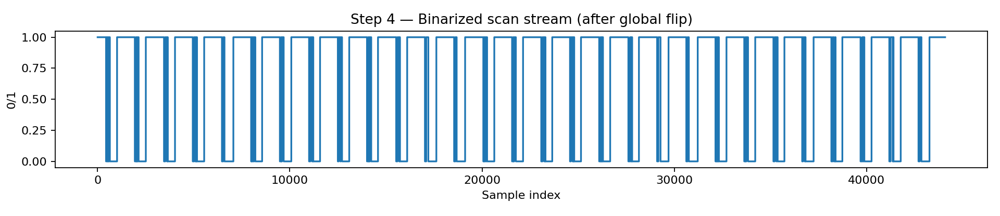
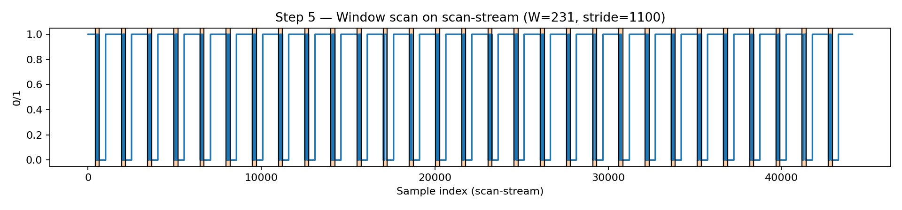
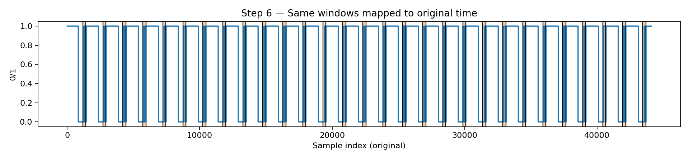
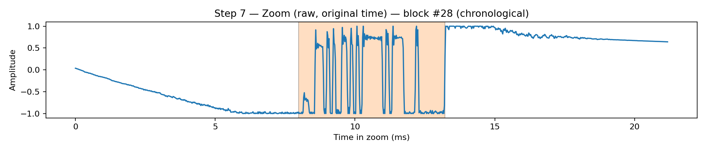
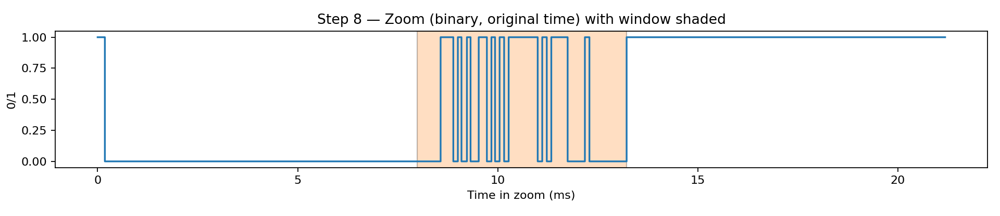
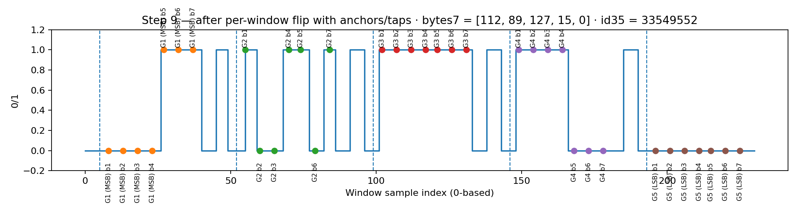

# Decoding Serial from Audio — NBU Lounge Example

This decoder extracts serials sent from Arduino embedded in a dedicated serial audio track.

> Example clip: recorded in **`nbu_lounge`** (source: `TRBD002_08062025-03.mp3`, path on Elias: `/mnt/datalake/data/TRBD-53761/TRBD002/NBU/2025-08-07/audio/lounge/TRBD002_08062025-03.mp3`, clipped with a 1-second window and converted to WAV for plotting).

---

## Why we flip the entire sequence first (the key idea)

Detecting a reliable **start-of-block** is easier if we conceptually "look from the end." Empirically, when scanning backward on the original stream, the **drop to `0`** marks the block start (payload comes first, then padding).

To keep the scan simple, we **globally flip** the binary stream once, scan forward in that flipped space, then map indices and ID order back to the original timeline.

Per-window flips (if enabled by the site preset) are only to ensure each sampled byte is read **MSB → LSB**.

---

## High-level algorithm (pseudocode)

```text
1) Read audio (wav/mp3) → mono float32 in [-1..1]
2) Normalize to [0,1]; threshold → binary stream (0/1)

3) Global flip (reverse entire binary stream):
   Rationale: scanning forward on the flipped stream is equivalent to
   scanning backward on the original and makes detecting block starts easy.

4) Scan the flipped stream:
   while i + W <= N:
     if stream[i] == 0:
        win = stream[i : i + W]
        if flip_window: win = reverse(win)

        # Sample 5 anchors × 7 taps each
        # Interpret taps MSB→LSB to get 5 values in [0..127]
        # Concatenate b5‖b4‖b3‖b2‖b1 → one 35-bit frame ID

        record (ID, start=i, end=i+W)
        i += stride
     else:
        i += 1

5) Map ranges back to original timeline and reverse the list of IDs/ranges
   so outputs are chronological.

6) Write CSV: serial,start_sample,end_sample
```

---

## Visual tour: from raw wave to 35-bit IDs

> The figures below are produced by `scripts/tools/make_serial_plots.py` and saved under  
> `../../assets/serial/`.

### 1) Raw serial audio (overview)
Short “bursty” plateaus carry the embedded bits.



### 2) From wave to binary
Normalize to `[0,1]` and pick a threshold (default `0.5`):

![Normalized to [0,1] with threshold](../../assets/serial/step02_normalized.png)

Then binarize to get the decoder’s 0/1 stream (original, pre-flip):



### 3) Global flip (why & effect)
We reverse the **entire** 0/1 stream so that the **first `0`** we see while scanning forward corresponds to a **start-of-block** (equivalently: scanning backward on the original and firing on 1→0 drops).



### 4) Window selection on the scanning stream
Take windows of length **`W`** (site-specific; for **nbu_lounge** we use **231**) and hop by **`stride ≈ 1100`**.



### 5) Same windows mapped back to original time
For intuition, the same windows (starts/ends) shown on the original (pre-flip) axis:



### 6) Zoom one decoded block (original time)
Zoom around a specific chronological block (by index), shading the exact sampling window:



Zoomed binary view of the same region:



### 7) Inside the window: anchors, taps, and bit order
The actual window used for sampling (after optional per-window flip to guarantee MSB→LSB).  
We annotate **5 groups** (anchors) × **7 taps** each (dots), labeling **G1 (MSB)** through **G5 (LSB)** and listing the computed 7-bit byte values plus the concatenated **35-bit ID**. The bits are sampled based on empirical anchor points and offsets (counting backwards). Across NBU sleep room, NBU lounge, and Jamail, we use `anchors=[6, 53, 100, 147, 194]` and `offsets=[4, 9, 14, 19, 23, 28, 33, 37]` but we only sample the first 7 bits.



---

## MSB vs LSB — how bits become numbers

- **MSB (Most Significant Bit)**: left-most bit (largest weight).  
- **LSB (Least Significant Bit)**: right-most bit (smallest weight).

Example 7-bit pattern (MSB→LSB): `1 0 1 1 0 0 1`  
Value = `1·2^6 + 0·2^5 + 1·2^4 + 1·2^3 + 0·2^2 + 0·2^1 + 1·2^0 = 89`.

The decoder explicitly orders taps MSB→LSB.

---

## Preset + constants for `nbu_lounge` (empirical)

| Parameter | Meaning | Value / Note |
|---|---|---|
| `site` | Preset selection | `nbu_lounge` |
| `W` | **Sampling window length** | **231** |
| `stride` | Hop between starts | **≈ 1100** |
| Anchors (1-based) | Fixed positions inside the window | `[6, 53, 100, 147, 194]` |
| Tap offsets (1-based) | 8 documented; we use first **7** | `[4, 9, 14, 19, 23, 28, 33, 37]` |
| `flip_signal` | Reverse entire stream before scan? | **True** (so “first 0” is start) |
| `flip_window` | Reverse each window before taps? | **True** (guarantee MSB→LSB) |
| `threshold` | Binarization threshold in `[0,1]` | **0.5** typical (try 0.4–0.6) |

---

## Appendix: expected images (fresh run)

```
../../assets/serial/
  step01_raw.png
  step02_normalized.png
  step03_binary_preflip.png
  step04_binary_scanstream.png
  step05_scanstream_windows.png
  step06_original_windows.png
  step07_zoom_raw.png
  step08_zoom_binary.png
  step09_window_taps.png
```
